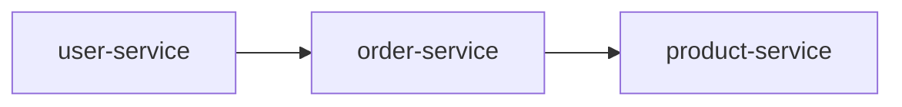

# asdm-domain-discovery: 发现并定义项目领域

## 目的

自动分析代码库结构，识别项目实际的业务领域和技术领域，帮助用户快速建立领域划分。

**核心原则**：基于项目实际的代码结构识别领域，而非套用预设模板。

## 语言检测

在分析之前，检测并使用当前环境的响应语言。

## 发现步骤

### 步骤 1: 扫描代码结构

首先扫描项目的实际目录和模块结构：

```bash
# 扫描 Java 项目包结构
find src -type d -name "java" -exec find {} -type d \; 2>/dev/null | \
  sed 's|.*/src/main/java/||' | sed 's|.*/src/test/java/||' | \
  grep -v '^$' | sort | uniq

# 扫描 TypeScript/JS 项目结构
find src -type d | sed 's|src/||' | grep -v '^$' | sort | uniq

# 扫描 Maven 多模块项目
find . -name "pom.xml" -not -path "./pom.xml" | xargs dirname | sed 's|^\./||'

# 扫描 Go 项目结构
find . -type d -name "internal" -o -type d -name "pkg" -o -type d -name "cmd" 2>/dev/null
```

### 步骤 2: 分析每个模块/包的职责

对于识别到的每个模块，分析其职责：

1. **分析入口文件**
   - 读取 `README.md` 或 `module.md`
   - 查看 package-info.java / index.ts / __init__.py

2. **分析核心类/接口**
   - 列出核心类名和接口名
   - 分析类的职责描述（注释、docstring）

3. **分析对外暴露的 API**
   - Controller/Router 定义
   - Service 接口定义

### 步骤 3: 基于实际结构归纳领域

**根据项目的实际包/模块结构**，归纳领域：

```
扫描结果示例：
├── user-service/
│   ├── UserController.java
│   ├── UserService.java
│   └── UserRepository.java
├── order-service/
│   ├── OrderController.java
│   ├── OrderService.java
│   └── OrderRepository.java
└── product-service/
    ├── ProductController.java
    └── ProductService.java

AI 归纳结果：
┌─────────────────────────────────────────────────────────┐
│  识别到的领域（基于实际结构）                            │
├─────────────────────────────────────────────────────────┤
│                                                         │
│  1. user-service (用户服务)                             │
│     - 职责：用户注册、认证、Profile 管理                 │
│     - 依据：UserController, UserService                 │
│                                                         │
│  2. order-service (订单服务)                            │
│     - 职责：订单创建、查询、状态管理                     │
│     - 依据：OrderController, OrderService               │
│                                                         │
│  3. product-service (商品服务)                          │
│     - 职责：商品信息管理、库存管理                       │
│     - 依据：ProductController, ProductService           │
│                                                         │
│  4. [其他模块...]                                       │
│                                                         │
└─────────────────────────────────────────────────────────┘
```

### 步骤 4: 评估领域边界和依赖

分析领域之间的依赖关系：

```markdown
## 领域依赖图


```

### 步骤 5: 生成领域发现报告

```markdown
# 领域发现报告

## 项目概述

**项目名称**：[实际项目名]
**代码结构**：微服务架构 / 单体架构 / ...

## 识别的领域

基于项目实际结构，识别到以下领域：

| # | 领域/模块名 | 职责描述 | 关键文件 | 代码量 |
|---|-------------|----------|----------|--------|
| 1 | [模块A] | [根据代码分析得出的实际职责] | [核心文件] | X 行 |
| 2 | [模块B] | [根据代码分析得出的实际职责] | [核心文件] | X 行 |
| 3 | [模块C] | [根据代码分析得出的实际职责] | [核心文件] | X 行 |

## 领域依赖关系

```mermaid
[基于实际依赖关系的图表]
```

## 建议

- [ ] 确认上述领域划分是否符合业务预期
- [ ] 是否有需要合并或拆分的模块
- [ ] 是否有遗漏的模块

## 下一步

确认领域后，使用 `/asdm-context-init` 初始化项目索引。
```

## 输出

| 输出 | 说明 |
|------|------|
| 领域发现报告 | 基于实际代码结构识别的领域 |
| 领域配置 | `.asdm/contexts/domains-config.json`（可选） |

## 使用方法

```bash
# 1. 发现领域
/asdm-domain-discovery

# 查看报告，确认领域列表

# 2. 初始化
/asdm-context-init

# 3. 按需构建领域索引
/asdm-domain-index-build <确认的领域名>
```

## 重要提醒

1. **不要预设领域**：不要假设项目一定有"用户域"、"订单域"
2. **基于实际结构**：根据项目实际的模块名、包名、目录名来判断
3. **分析代码得出职责**：通过分析代码、注释、README 来理解每个模块做什么
4. **用户确认**：最终领域划分需要用户确认
